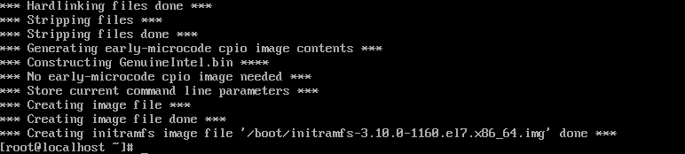

# System-boot-GRUB-
## Домашнее задание
### Попасть в систему без пароля несколькими способами
1.  **Способ 1**
2.  При загрузке ОС нажимаем  **e** .  Далее в конце строки, которая начинается с **linux /boot/vmlinuz....** пишем  ``` init=/bin/bash ```. Попадаем в ОС. Но в режиме **ro (read only)**. Используем комманду ``` mount -o remount,rw / ```  и проверяем, что можем создавать/ изменять под правами суперпользователя.
3.  
4.  
5.  
6.  **P.S.** т.к. у меня не получилось войти в систему Debian при загрузке командой ``` rd.break ```, установил ОС CentOS и изменил пароль как в ДЗ. Для Debian менял пароль root если при загрузке использовать ``` init=/bin/bash ```.
7.  **Способ 2**
8.   
9.   **Способ 3**
10.   В строке, начинающейся с linux16, заменяем ro на rw init=/sysroot/bin/sh и нажимаем сtrl-x - так же на CentOS - все получилось
11.   **Установить систему с LVM, после чего переименовать VG**
12.   CentOS была установлена с LVM
13.   ```  vgrename ls -l OtusRoot ```
14.    
15. Далее правим /etc/fstab, /etc/default/grub, /boot/grub2/grub.cfg. Везде заменяем старое название на новое
16.  ``` mkinitrd -f -v /boot/initramfs-$(uname -r).img $(uname -r) ```
17.   
18.   **Добавить модуль в initrd**
19.   ``` mkdir /usr/lib/dracut/modules.d/01test ```
20.   В нее поместим два скрипта: 1. module-setup.sh - который устанавливает модуль и вызывает скрипт test.sh   2. test.sh - собственно сам вызываемый скрипт, в нём у нас рисуется пингвинчик
21.   mkinitrd -f -v /boot/initramfs-$(uname -r).img $(uname -r)
22.   dracut -f -v
23.   


